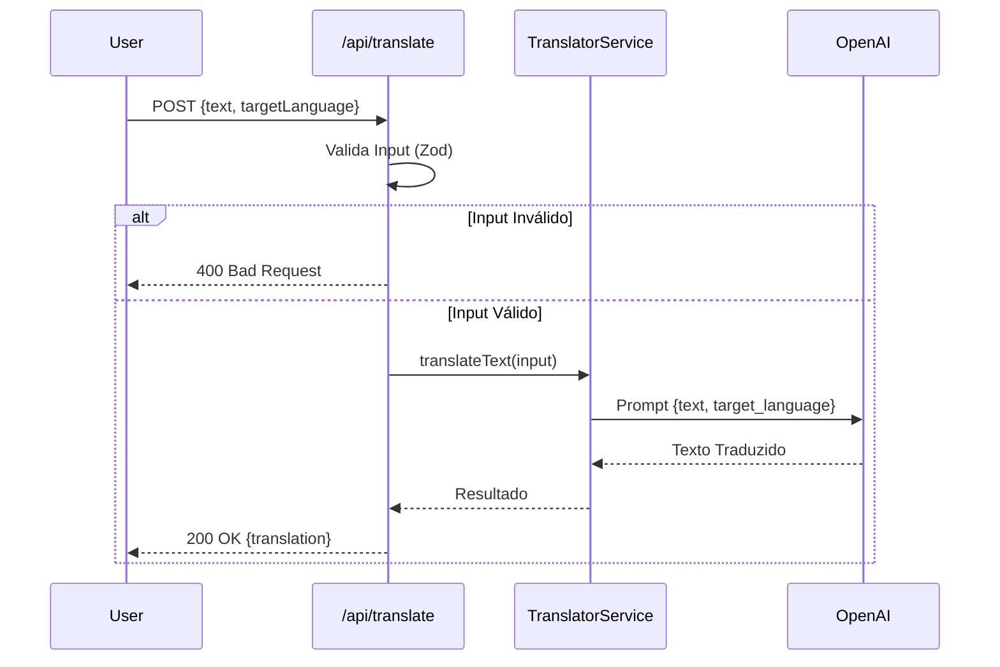

# Tradutor Inteligente (Smart Translator)

Esta funcionalidade fornece um serviço de tradução de texto utilizando Modelos de Linguagem (LLM) via LangChain.

## Visão Geral

O sistema aceita um texto e um idioma de destino, retornando o texto traduzido. Ele utiliza a OpenAI (`gpt-3.5-turbo`) como backend de processamento.

## Endpoint API

### `POST /api/translate`

#### Request Body
```json
{
  "text": "Texto a ser traduzido",
  "targetLanguage": "Idioma Alvo (ex: Portuguese)"
}
```

#### Response (200 OK)
```json
{
  "translation": "Texto traduzido"
}
```

#### Response (400 Bad Request)
```json
{
  "error": "Invalid input",
  "details": { ... }
}
```

## Arquitetura

### Componentes

1.  **Translator Service** (`src/lib/ai/translator.ts`):
    *   Gerencia a lógica de negócio.
    *   Constrói o prompt template.
    *   Invoca o modelo LLM.
    *   Usa `zod` para tipagem de entrada.

2.  **API Route** (`src/app/api/translate/route.ts`):
    *   Handler HTTP do Next.js.
    *   Valida entrada com `zod`.
    *   Gerencia erros HTTP.

### Fluxo



## Testes

*   **Unitários:** `__tests__/lib/translator.test.ts` valida a lógica do serviço e mocks do LangChain.
*   **Integração:** `__tests__/api/translator.test.ts` valida o endpoint HTTP e códigos de resposta.
